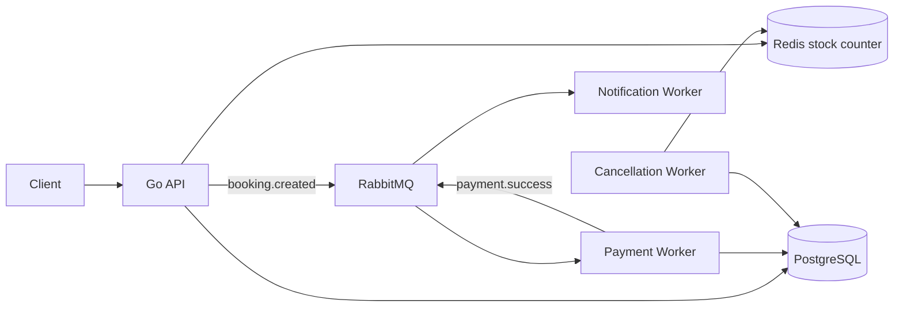

# tix.at

High-Concurrency Ticket Reservation System — Go + Redis + RabbitMQ + PostgreSQL.
Fokus: ribuan booking request tanpa overselling.



## Quick start

```bash
docker compose up --build
```

Coba flow dasar:

```bash
curl -X POST localhost:8080/events \
  -H 'content-type: application/json' \
  -d '{"id":"concert-1","name":"War Ticket Demo","stock":100}'

curl -X POST localhost:8080/bookings \
  -H 'content-type: application/json' \
  -d '{"event_id":"concert-1","user_id":"u1"}'
```

Load test:

```bash
k6 run loadtest/booking.js
```

## Test result

| Skenario | Hasil |
|---|---:|
| 150 booking paralel, stock 100 | 100 accepted, 50 sold out |
| Redis stock akhir | 0 |
| Booking DB dibuat | 100 |
| Overselling | 0 |
| Payment worker mati lalu nyala | queue redeliver, 2 booking jadi `PAID` |
| Booking expired | status `CANCELLED`, Redis stock balik |

## Design decisions

- **Redis Lua untuk stok:** decrement atomik, jadi overselling tidak lolos walau request paralel.
- **RabbitMQ untuk pembayaran:** API cepat balas `PENDING`; payment diproses async.
- **PostgreSQL sebagai source of truth:** event dan booking final disimpan di DB.
- **Cancellation worker:** booking `PENDING` lewat TTL jadi `CANCELLED`, stock Redis dikembalikan.
- **Satu bahasa BE:** semua service Go supaya fokus ke concurrency, bukan polyglot setup.

## Struktur

```txt
cmd/api              REST API
cmd/payment-worker   consume booking.created
cmd/notification     consume payment.success
cmd/cancellation-worker cancel expired bookings
internal/            shared infra tipis, tanpa business logic berat
loadtest/            k6 script
migrations/          schema PostgreSQL
```

Dokumentasi perencanaan ada di [`docs/`](docs/).
