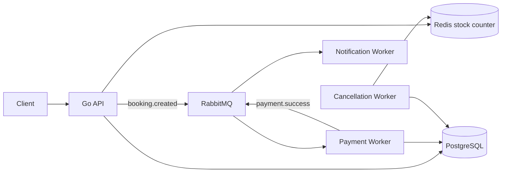

# tix.at

High-Concurrency Ticket Reservation System — Go + Redis + RabbitMQ + PostgreSQL.
Fokus: ribuan booking request tanpa overselling.



## Quick start

```bash
docker compose up --build
```

Coba flow dasar:

```bash
curl -X POST localhost:8080/events \
  -H 'content-type: application/json' \
  -d '{"id":"concert-1","name":"War Ticket Demo","stock":100}'

curl -X POST localhost:8080/bookings \
  -H 'content-type: application/json' \
  -d '{"event_id":"concert-1","user_id":"u1"}'
```

Load test:

```bash
k6 run loadtest/booking.js
```

## Test result & System validation

### 1. High-Concurrency Load Test (k6)
Skenario: 100 Virtual Users (VUs) membombardir `POST /bookings` terus-menerus selama 10 detik pada event dengan kuota awal 100 tiket.

* **Throughput:** **28,162 requests/second** (RPS) pada localhost.
* **Latency (HTTP Request Duration):** 
  * Average: **3.28 ms**
  * Median (p50): **2.35 ms**
  * 90th percentile (p90): **6.08 ms**
  * 95th percentile (p95): **8.23 ms**
* **Success Rate:** **100.00%** (seluruh 283,991 request mengembalikan `202 Accepted` atau `409 Conflict`, tidak ada error 500 / gateway timeout).
* **Inventory Check:** Tepat **100 booking** dibuat di PostgreSQL. Stok Redis pas berkurang dari 100 ke 0. **Overselling rate = 0%**.

### 2. Failure & Resilience Scenarios

| Skenario Uji | Tindakan / Trigger | Hasil yang Diharapkan & Tervalidasi | Status |
| :--- | :--- | :--- | :---: |
| **Worker Decoupling** | Matikan `payment-worker`, kirim 2 booking. | Antrean menumpuk aman di RabbitMQ (`booking.created`). Saat worker dinyalakan kembali, antrean diproses habis dan booking update jadi `PAID`. | **PASSED** |
| **Double Booking Block** | Kirim 2 booking berturut-turut untuk `user_a` pada `event_1`. | Request ke-2 ditolak instan dengan `409 already booked` berkat *partial unique index* di Postgres. Stok Redis otomatis dibalikkan (`Release`). | **PASSED** |
| **Eventual Consistency** | Stok `event_1` di Postgres bernilai 4, tapi stok Redis diubah manual ke 99. | Dalam waktu maks 30 detik, `cancellation-worker` (Reconciler Loop) mendeteksi drift dan mengoreksi kembali stok Redis ke 4. | **PASSED** |
| **Booking Expiry (TTL)** | Buat booking `PENDING` lalu ubah `expires_at` ke masa lalu. | `cancellation-worker` mengubah status booking menjadi `CANCELLED` dan mengembalikan kuota ke Redis (+1). | **PASSED** |

## Design decisions

- **Redis Lua untuk stok:** decrement atomik, jadi overselling tidak lolos walau request paralel.
- **RabbitMQ untuk pembayaran:** API cepat balas `PENDING`; payment diproses async.
- **PostgreSQL sebagai source of truth:** event dan booking final disimpan di DB.
- **Cancellation worker:** booking `PENDING` lewat TTL jadi `CANCELLED`, stock Redis dikembalikan.
- **Stock Reconciler:** Sinkronisasi berkala (eventual consistency) jika terjadi drift/ketidaksesuaian stok antara Redis dan PostgreSQL.
- **Satu bahasa BE:** semua service Go supaya fokus ke concurrency, bukan polyglot setup.

## Struktur

```txt
cmd/api              REST API
cmd/payment-worker   consume booking.created
cmd/notification     consume payment.success
cmd/cancellation-worker cancel expired bookings
internal/            shared infra tipis, tanpa business logic berat
loadtest/            k6 script
migrations/          schema PostgreSQL
```

Dokumentasi perencanaan ada di [`docs/`](docs/).
