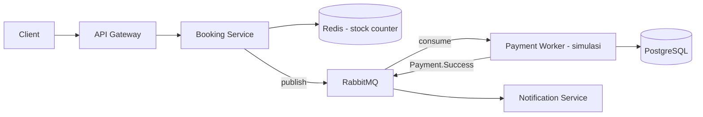

# tix.at

High-Concurrency Ticket Reservation System — proyek latihan microservices.
Fokus: menangani ribuan concurrent request tanpa overselling.

## Dokumentasi

| File | Isi |
|------|-----|
| [docs/01-konsep-microservices.md](docs/01-konsep-microservices.md) | Bahasa sama vs polyglot, code sharing antar-service, REST vs gRPC, kontrak `.proto` |
| [docs/02-ide-dan-arsitektur-proyek.md](docs/02-ide-dan-arsitektur-proyek.md) | Ide proyek, perbandingan kerumitan, kenapa pilih sistem tiket |
| [docs/03-load-testing.md](docs/03-load-testing.md) | Simulasi ribuan pengguna dengan k6, pembatasan resource Docker, inject latency |
| [docs/04-portofolio.md](docs/04-portofolio.md) | Nilai microservices di CV, jebakan overengineering, formula README yang dilirik Tech Lead |

## Status

Tahap perencanaan. Belum ada kode.

## Rencana Arsitektur (draft)

