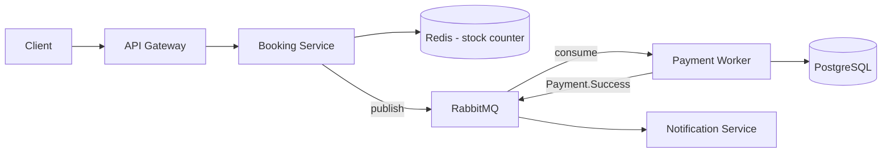

# Nilai Portofolio & Formula README

## Seberapa Penting Microservices di Portofolio?

Sangat bernilai untuk perusahaan enterprise / startup papan atas / posisi di atas junior — tapi bukan kewajiban mutlak semua lowongan.

### Yang dibisikkan proyek microservices ke Tech Lead

1. **Paham jaringan** — REST, gRPC, message broker (RabbitMQ/Kafka), bukan cuma panggil fungsi.
2. **Akrab DevOps dasar** — Docker & Docker Compose sudah pasti terpakai.
3. **Mindset system design** — memecah data, mengatur database, sistem tetap jalan meski satu komponen mati.

Nilai plus instan di README: *"Diuji dengan k6 pada 1.000 req/detik, response time < 200ms berkat arsitektur async."*

### Jebakan yang harus dihindari

- **Overengineering** — aplikasi todo list dipecah 5 service = cari penyakit, kelihatan maksa.
- **Microservices palsu** — kode dipecah 3 service tapi database barengan dan saling `JOIN` langsung. Menunjukkan belum paham Database per Service.

### Komposisi portofolio ideal

1. **1 proyek Monolith matang** — Clean/Hexagonal Architecture, unit testing rapi, clean code.
2. **1 proyek Microservices kecil spesifik** — 2-3 service (core + async worker), dokumentasi fokus ke komunikasi antar-service dan hasil load test.

## Formula README yang Dilirik Tech Lead

Kunci: **jual keputusan arsitektur, bukan fitur.**

### 1. Judul + tagline masalah (bukan nama aplikasi)

❌ `# Ticket Booking App — aplikasi pemesanan tiket dengan fitur login, booking...`

✅
```markdown
# High-Concurrency Ticket Reservation System
Sistem reservasi tiket yang menangani 5.000+ concurrent requests
tanpa overselling, dibangun dengan Go, Redis, dan RabbitMQ.
```

### 2. Diagram arsitektur (WAJIB, pakai Mermaid — render langsung di GitHub)



### 3. Design Decisions — jantungnya README

Format: **masalah → solusi → trade-off**. 3-4 keputusan cukup.

```markdown
### Kenapa cek stok di Redis, bukan langsung ke PostgreSQL?
**Masalah:** Saat war tiket, ribuan UPDATE ke row yang sama
membuat row-level lock contention — throughput anjlok.

**Solusi:** Stok di-mirror ke Redis. Pemotongan kuota pakai Lua script
(atomik), DB utama hanya menerima write dari queue secara terkontrol.

**Trade-off:** Risiko drift Redis vs DB. Ditangani reconciliation job
setiap 30 detik.
```

### 4. Angka hasil load test (bukti, bukan klaim)

```markdown
| Skenario             | RPS   | p95 Latency | Error Rate | Overselling |
|----------------------|-------|-------------|------------|-------------|
| Baseline (direct DB) | 180   | 2.400ms     | 14%        | 37 tiket ❌ |
| Redis + Queue        | 2.100 | 95ms        | 0%         | 0 tiket ✅  |
```

Tabel before/after = senjata paling ampuh. Sertakan skrip k6 di `/loadtest` agar bisa diverifikasi.

### 5. Failure Scenarios (pembeda level senior)

```markdown
- **Payment worker mati saat proses:** pesan tidak di-ack, RabbitMQ
  redeliver ke worker lain. Idempotency key mencegah double-charge.
- **User tidak bayar dalam 5 menit:** cron worker batalkan booking
  PENDING dan kembalikan kuota ke Redis.
- **Redis restart:** stok di-rebuild dari PostgreSQL saat startup.
```

### 6. Quick start — harus 1 perintah

```bash
docker compose up -d
```

10 langkah setup manual = reviewer tidak akan coba.

### 7. Yang TIDAK perlu ditulis

- Daftar fitur CRUD ("user bisa register, login, logout...")
- Screenshot halaman login
- Tech stack sebagai daftar belanjaan tanpa konteks — sebut teknologi di dalam design decisions
- Badge berlebihan

### Urutan final

```
1. Judul + tagline masalah teknis
2. Diagram arsitektur (Mermaid)
3. Design Decisions (masalah → solusi → trade-off)
4. Hasil load test (tabel before/after)
5. Failure handling
6. Quick start (1 perintah)
7. Struktur folder singkat (opsional)
```

**Inti:** README pemula menjawab "apa yang aplikasi ini bisa lakukan"; README yang dilirik menjawab "masalah teknis apa yang saya selesaikan dan kenapa memilih solusi ini."
